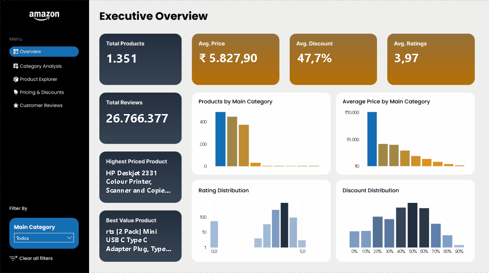
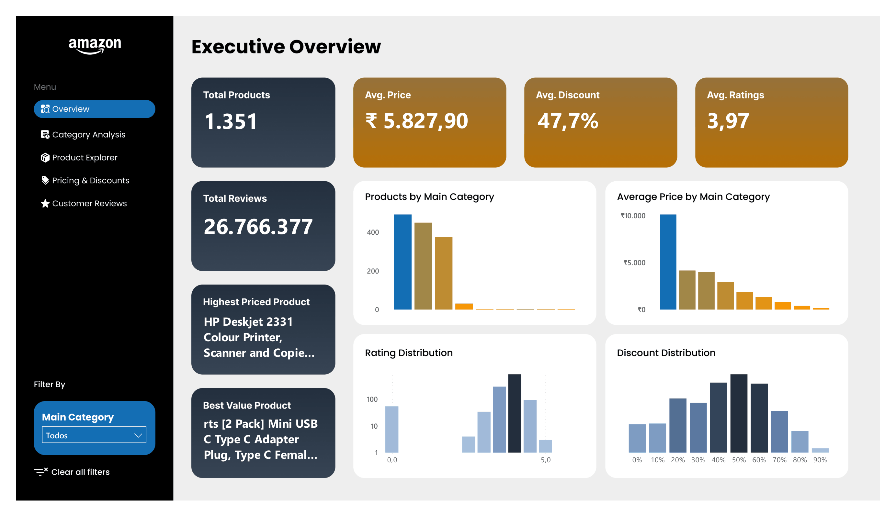
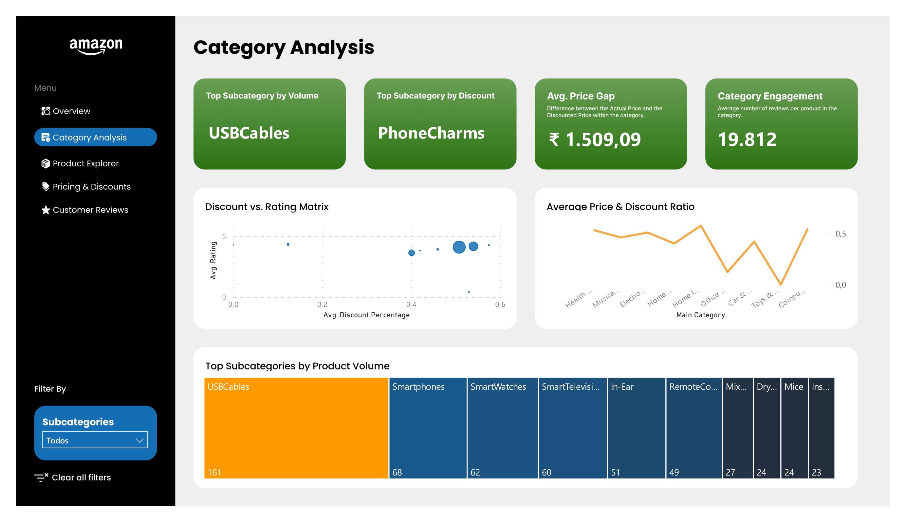
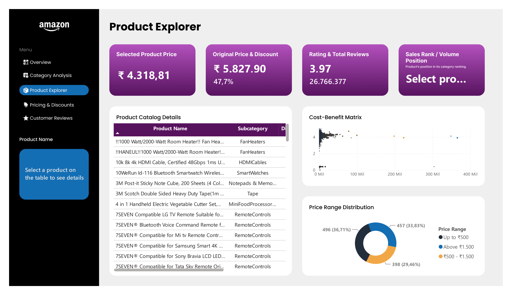
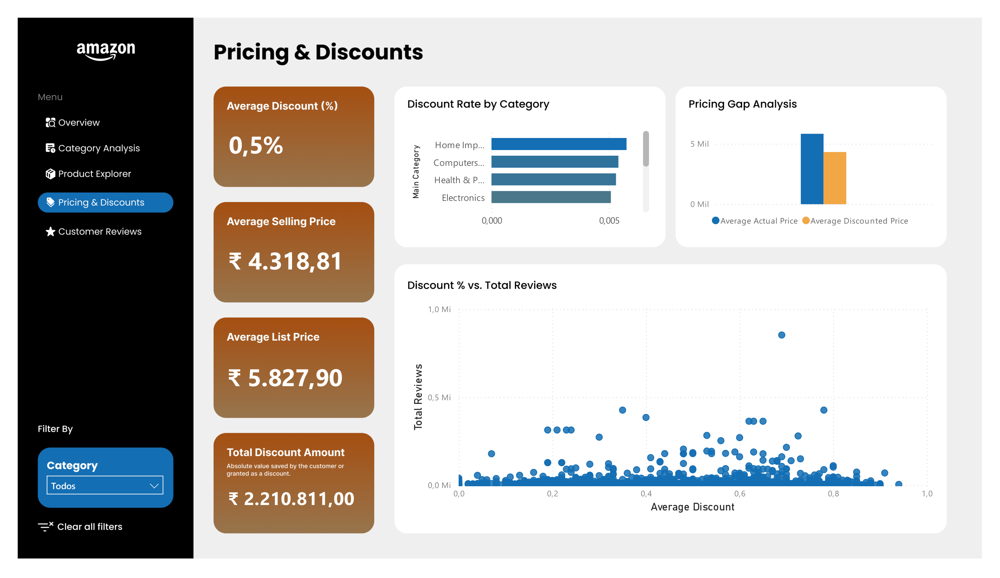
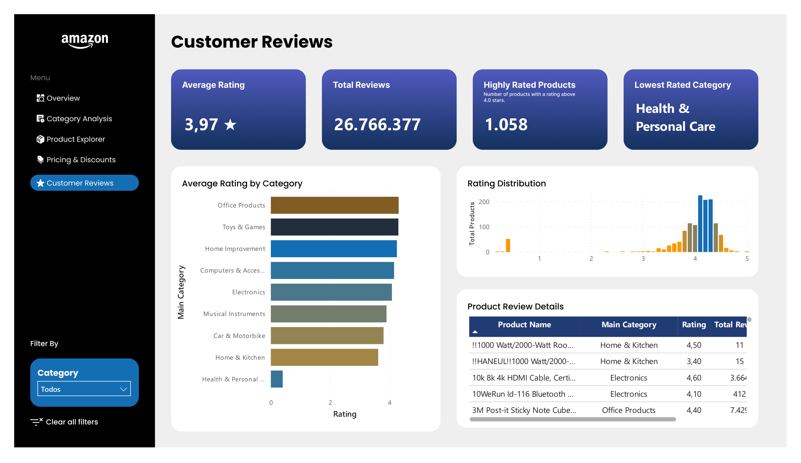

# Amazon Product Analytics Dashboard

<p align="center">
  
</p>

## Overview

This project presents an interactive **Power BI dashboard** developed to analyze Amazon product data using information on pricing, discounts, categories, ratings, and customer reviews.

The dashboard was designed to provide an executive-level overview while also allowing users to explore products, compare categories, evaluate pricing strategies, and analyze customer feedback through multiple interactive report pages.

---

## Project Objectives

The dashboard was developed to answer questions such as:

- How many products are available in the dataset?
- Which product categories contain the largest number of products?
- How are discounts distributed across the catalog?
- Which categories have the highest average prices?
- Which products stand out based on ratings and customer reviews?
- How can users efficiently explore products through interactive filtering?

---

## Dataset

- **Source:** Amazon Sales Dataset (Kaggle)
- **Records:** 1,400+ Amazon products
- **Main Features:**
  - Product information
  - Categories
  - Actual and discounted prices
  - Discount percentages
  - Ratings
  - Rating counts
  - Customer reviews
  - Product links

The entire dashboard was built using a single dataset (`amazon.csv`).

---

# Dashboard Pages

## Executive Overview

<p align="center">
  
</p>

Provides a high-level summary of the dataset through KPIs and executive visualizations, allowing users to quickly understand the overall catalog.

Main indicators include:

- Total Products
- Total Reviews
- Average Price
- Average Discount
- Average Rating

---

## Category Analysis

<p align="center">
  
</p>

Explores product distribution across categories, highlighting pricing, discounts, ratings, and catalog composition.

---

## Product Explorer

<p align="center">
  
</p>

Allows detailed exploration of individual products, including pricing information, ratings, and product descriptions through interactive filtering.

---

## Pricing & Discounts

<p align="center">
  
</p>

Analyzes pricing strategies by comparing actual prices, discounted prices, and discount percentages across different product categories.

---

## Customer Reviews

<p align="center">
  
</p>

Focuses on customer ratings and review metrics, helping identify highly rated products and overall customer satisfaction.

---

# Data Preparation

Data preparation was performed entirely in **Power Query**, including:

- Data type conversion
- Currency symbol removal
- Price conversion to numeric values
- Discount percentage conversion
- Rating count cleaning
- General data formatting

---

# DAX Measures

The dashboard includes custom DAX measures used to calculate key business indicators, including:

- Total Products
- Total Reviews
- Average Price
- Average Discount
- Average Rating

---

# Technologies Used

- Microsoft Power BI Desktop
- Power Query
- DAX
- Kaggle Dataset

---

# Repository Structure

```
amazon-product-analytics-dashboard/
│
├── assets/
├── data/
├── images/
├── Amazon_Product_Analytics_Dashboard.pbix
└── README.md
```

---

# How to Open

1. Download the repository.
2. Open `Amazon_Product_Analytics_Dashboard.pbix` using Power BI Desktop.
3. Interact with the report pages and filters.

---

# Author

**Matheus Rocha**

Statistics Undergraduate at UFMG

GitHub: https://github.com/matheusoch